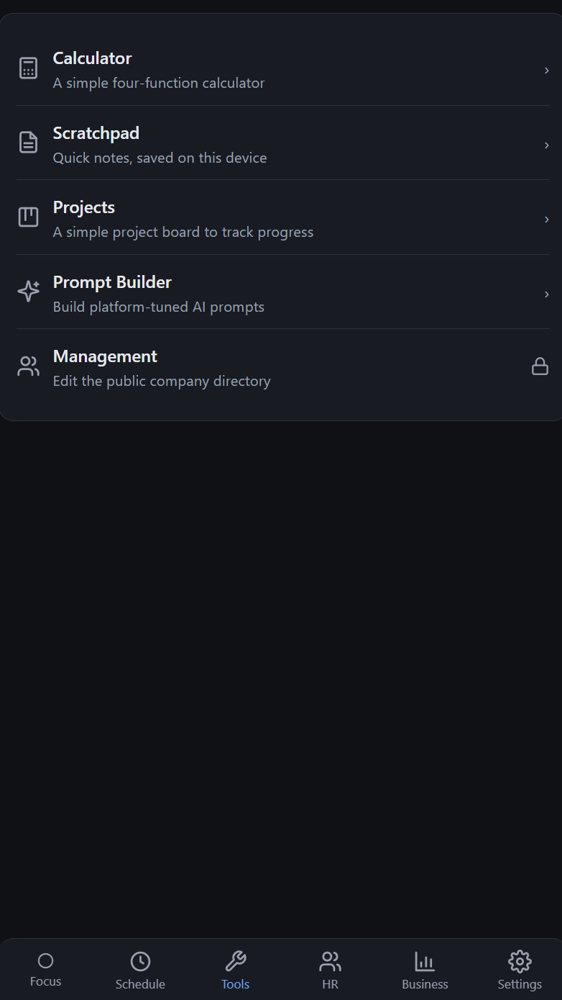

[](https://github.com/TolinSimpson/business-management-suite/actions/workflows/deploy.yml)

# Business Management Suite

An all-in-one app for running a small team from your phone: everyone sees their own
daily schedule, a shared staff directory, and a simple budget/pay overview — plus
handy tools like a project board and quick notes. Team members just open a link:
nothing to install and no account to create. A manager keeps everything up to date
and it syncs out to everyone automatically.

Add it to your phone's home screen and it behaves like a normal app, even offline.
It's **free and open-source**, so you can run your own copy for your company — see
**Set up your own copy** below.

Under the hood it's a lightweight web app (a PWA built with Svelte) with **no server
or database to run**: the shared company info lives in one small file the manager
publishes, and everything personal stays on your own device.

<p align="center">
  
</p>

---

<details open>
<summary><b>What's inside</b> — the five tabs</summary>

Footer tabs: **Focus · Schedule · Tools · HR · Business · Settings**.

- **Schedule** (Now) — shows the block you should be in *right now* from a
  role-based template (software, construction, landscaping, childcare, retail,
  office, healthcare, hospitality), resolved from this device's identity. Per-block
  checklists and (for software) an end-of-day "plan for tomorrow" form that feeds
  the next day's slots. Company holidays replace the schedule for the day. An
  hourly chime moves you to the next block while the app is open.
- **Tools** — a modular tool drawer (see *Tools* below): Calendar, Scratchpad,
  Projects (kanban + email progress report), Prompt Builder, and the admin-gated
  Management tool.
- **HR** — company social links plus the team directory from `config.json`, each
  member with call / email / view-schedule actions.
- **Business** — the budget model: gross revenue → tax + vendor → post-tax pool →
  itemised reserve funds → worker wage pool split by role multiplier. Log monthly
  actuals to switch projections to real figures; a "reserve funds on hand" total
  accumulates across logged months. Dependency-free SVG donut + breakdown.
- **Settings** — your employee profile (who this device is), off-hours/weekend schedule + daily wake
  alarm, notification permission / sound / alert style / Focus hours, admin
  lock, and reset.

**Focus mode** (toolbar toggle): keeps the screen awake (Screen Wake Lock API) and
goes full-screen on the current block, so the in-tab chime keeps firing. Best with
the phone on a charger during the workday. The one limit a PWA can't escape: alerts
only fire while the app is **open** — a true locked-pocket alarm would need a
native build.

</details>

<details>
<summary><b>Develop</b></summary>

```bash
npm install
npm run dev        # http://localhost:5173
npm test           # vitest (53 tests: finance, schedule, share, templates)
npm run check      # svelte-check type check
npm run build      # -> dist/
npm run preview    # serve the production build
```

</details>

<details>
<summary><b>Layout</b></summary>

```
src/
  lib/
    types.ts        AppState + OrgConfig (shared directory) models
    state.ts        localStorage-backed app store + mutators
    defaults.ts     seed device state (settings, off-hours routine)
    schedule.ts     pure now-computation (active block, alarm times, 12h format)
    templates.ts    role-template registry + resolution (+ personal/custom/holiday)
    finance.ts      budget math (breakdown, wage allocation, reserve accumulation)
    config.ts       fetch/cache the shared config.json; decrypt PII view
    access.ts       app access gate state + the live PII decryption key
    crypto.ts       PBKDF2 + AES-GCM encrypt/decrypt for PII fields
    github.ts       per-manager PAT — admin gate + Contents API publish of config.json
    biometric.ts    WebAuthn platform-authenticator unlock (Face ID / fingerprint)
    workers.ts      role ordering / labels
    share.ts        encode/decode a read-only schedule snapshot + detail levels
    notify.ts       in-session hourly chime + Notification API
    focus.ts        Focus-mode store      wakelock.ts  screen wake lock
    tools.ts        tool registry (import.meta.glob over src/tools/*.svelte)
  components/        Now, HR, Business, Tools, Settings, Pie, Checklist,
                     Icon, EmailModal, AdminGate, AccessGate, ShareView
  tools/            Calendar, Scratchpad, Projects, PromptBuilder, Management
  templates/        one ScheduleTemplate per role (software, construction, …)
  email-templates/  mailto: templates (check-in, sick-day, meeting-request, …)
  App.svelte        tab shell + access gate + share-link route
tests/              vitest (53 tests)
```

Drop a self-contained `.svelte` into `src/tools/` that exports `meta` in a
`<script module>` block and it auto-appears in the Tools drawer (set
`admin: true` to put it behind the admin gate).

</details>

<details>
<summary><b>Install as a PWA</b></summary>

The web build is an installable PWA (service worker + manifest + icons via
`vite-plugin-pwa`). On your phone, open the app URL in Chrome → **Add to Home
screen** — it then launches standalone and works offline. Deploy `dist/` to any
static host (GitHub Pages, Netlify, Cloudflare Pages, …); the included GitHub
Pages workflow is described below.

</details>

<details>
<summary><b>Set up your own copy (deploy to GitHub Pages)</b></summary>

A workflow at [`.github/workflows/deploy.yml`](.github/workflows/deploy.yml) builds
the PWA and publishes it on every push to `main`.

**One-time setup**

1. Get the code into your own GitHub repo (fork it, or create a repo and push).
2. **If it's a fork, enable Actions.** Open the **Actions** tab and click
   *"I understand my workflows, enable them"* — forks ship with Actions **disabled**,
   so nothing deploys until you do this.
3. **Settings → Pages → Build and deployment → Source → GitHub Actions.** *Not*
   "Deploy from a branch" — that serves the repo's dev `index.html`
   (`<script src="/src/main.ts">`) and renders a blank page.
4. **Deploy:** push to `main`, or run it by hand via **Actions → Deploy to GitHub
   Pages → Run workflow** (`workflow_dispatch`). The site goes live at
   `https://<owner>.github.io/<repo>/`.

**Public vs private / org repos**

- **Personal public repo** — the simplest path; free Pages just works.
- **Private repo (personal or org)** — free Pages **won't serve it**. Either make the
  repo **public** (the app encrypts staff details precisely because the config file is
  world-readable), upgrade to **GitHub Pro/Team**, or host the built `dist/` on
  **Cloudflare Pages / Netlify** (both deploy a *private* repo for free; only the
  hosting moves — the in-app publish still writes to GitHub).
- **Org-owned repo** — publishing needs an **org-scoped token**; see *Managers:
  publishing updates* below.

The workflow builds with `BASE_PATH=/<repo>/` so asset URLs resolve under the
project-site subpath. Routing is hash-based (`#s=…` share links), so there's no SPA
404 fallback, and the Actions deploy path skips Jekyll, so no `.nojekyll` is needed.

**Publishing ties in:** the in-app **Publish** button commits `public/config.json`
via the GitHub API, which re-triggers this workflow; devices pick up the change on
their next ~5-min check.

**`config.json` is gitignored.** It's the live directory a manager publishes, not a
source file, so it isn't tracked. A working default is generated from
[`public/config.example.json`](public/config.example.json) on `npm run dev` / `build`
(see [`scripts/ensure-config.mjs`](scripts/ensure-config.mjs)), so a fresh clone or
fork still serves a default until the first publish — after which the published
`config.json` (committed by the API) takes over.

</details>

<details>
<summary><b>Shared directory, access password &amp; PII encryption</b></summary>

The HR and Business tabs read a **shared org directory** from `config.json` —
company info, the employee list, finance/wage policy, schedule assignments,
holidays. Every device fetches it read-only (network-first, cached for offline,
re-checked every ~5 min), so non-managers get updates with **no login**.

### First-run setup

A freshly forked + deployed app ships **unconfigured** (`config.json` has
`setupComplete: false` and no `pii`). The first screen offers **manager setup** —
sign in with a fine-grained GitHub token (the same one used to publish, below) to
unlock the tools; team members can tap **Continue without signing in** to browse.
Once a manager publishes, the config is stamped `setupComplete: true` and every
device behaves normally from then on.

### Access gate (shared password)

A manager can put the whole app behind a **shared access password** (Management →
**Access gate password**) that team members are told *out-of-band* (never
committed). On first launch they enter it once; it's saved to the device and can be
replaced by **biometric** (Face ID / fingerprint, via WebAuthn) on later launches.
The sign-in screen also has:

- **Forgot password** — emails the manager to request the password (set the
  contact address in Management → **Tool access & locks → Manager email**).
- **First time setup** — a manager without the password (e.g. on a new device) can
  get in with their GitHub token instead.

### Why the password matters: staff-info encryption

`config.json` is meant to live in a **public** repo, so each employee's **name,
phone, email, and schedule are encrypted at rest** (AES-GCM, key derived from the
access password via PBKDF2-SHA256; see `src/lib/crypto.ts`). Only their **role** and
company-wide figures (revenue, wage policy) stay as public plain text. The
encryption keeps staff details away from the *general public* — anyone with the
access password can read them, by design. The password is **never** stored in the
repo; if it were, it'd be public alongside the data and the encryption would be
pointless.

### Locking individual tools

Beyond the app-wide gate, a manager can password-protect specific tools for a
scoped user (Management → **Tool access & locks**) — e.g. a *Finance Officer* who
can open a payroll tool but nothing else. This is a **convenience gate, not
bank-grade security**: the tool code is in the public app, so a technical user could
bypass it. Managers (signed in with their token) can open every tool.

</details>

<details>
<summary><b>Managers: publishing updates</b></summary>

Reads need nothing. **Writes** use a per-manager **fine-grained GitHub token**
stored **only on that manager's device** — never bundled (the source is public).

**Create the token** (always under *your account*, not the repo — repos have no
"create token" option). Go to **avatar → Settings → Developer settings → Personal
access tokens → Fine-grained tokens → Generate new token**:

1. **Resource owner** — your account for a personal repo, or **the organization** if
   the repo is org-owned.
2. **Repository access → Only select repositories →** this repo.
3. **Permissions → Contents → Read and write.**

> **Org-owned repos:** the org must *allow* fine-grained tokens, and may require
> approval. An org owner sets this at **Org → Settings → Third-party Access →
> Personal access tokens**; an unapproved token stays **pending** (and won't publish)
> until approved under *Pending requests*.

**Then, in the app** — access-gate **First time setup**, or **Management → Publish →
Publish to GitHub**:

1. `owner` / `repo` (repo defaults to `business-management-suite`), config path
   (default `public/config.json`), and branch (`main`); paste the token and
   **Save token**. The owner/repo are also saved into the published `config.json` so
   a second manager's device prefills them automatically.
2. **Publish** — it commits `config.json` (staff details encrypted) via the GitHub
   Contents API. Devices pick it up on their next poll (~5 min).

Concurrent edits are conflict-checked (a clear 409 message rather than a clobber).
You can also **Download / Copy** the encrypted JSON and commit it manually. The
management tools are unlocked by entering your **GitHub token** (validated live in
`AdminGate`), not a separate password — the token is the real write authority, so
there's a single secret to manage, stored on that device only.

</details>

<details>
<summary><b>Tools</b></summary>

- **Calendar** — add one-off appointments to your own schedule on a chosen day
  (they appear at their time on the Now screen; optionally replace the whole day).
- **Scratchpad** — quick notes, saved on this device.
- **Projects** — a simple kanban board (To do / In progress / Done) with multiple
  projects and an emailed progress report (recipient pulled from the directory).
- **Prompt Builder** — build platform-tuned AI prompts.
- **Management** *(admin)* — edit and publish the whole directory: company info &
  socials, finance/budget policy, employees (role, contact, schedule template or a
  bespoke per-person schedule), default template & holidays, monthly actuals, plus
  the access password and GitHub publish controls.

</details>

<details>
<summary><b>Share links</b></summary>

From **HR → view schedule**, a member's day is compressed into a `#s=…` URL hash —
open that link anywhere for a read-only view (`ShareView`). The encoder
(`src/lib/share.ts`) supports overview / detailed / full detail levels; planning
inputs are author-time config and are never shared. No account, no server; the data
lives entirely in the link.

</details>
